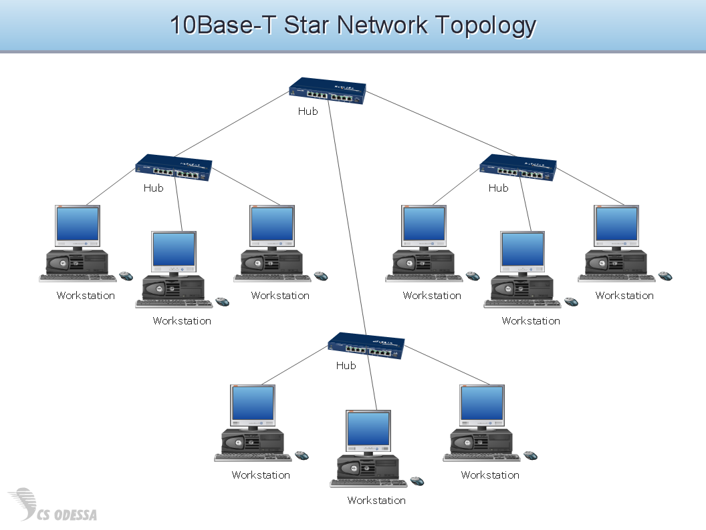

# Smart India Hackathon Workshop
# Date:27/11/2024
## Register Number:24900112
## Name:HARI PRASATH.P
## Problem Title
Implementation of the Alumni Association platform for the University/Institute.
## Problem Description
Background: Alumni associations play a pivotal role in fostering lifelong connections between graduates and their alma mater, facilitating networking, mentorship, and philanthropic support. However, many alumni associations face challenges in maintaining engagement, facilitating donations, and providing valuable services such as job networking and tracking alumni success stories. A comprehensive Alumni Association platform for a University/Institute, encompassing both web and mobile applications, aims to address these challenges effectively. Detailed Description: The proposed Alumni Association platform for the Government Engineering College will feature robust functionalities accessible through both web and mobile applications: Alumni Registration: User-friendly registration processes on both web and mobile platforms, allowing alumni to join the association, update their profiles, and stay connected with peers and the institution. Donation Portal: Secure mechanisms on both platforms for alumni to contribute donations easily and support various initiatives and projects undertaken by the college, fostering a culture of philanthropy. Networking Hub: Dedicated sections on both platforms to connect alumni based on shared interests, professions, and geographic locations, facilitating professional networking, mentorship, and collaboration opportunities. Job Portal: Integrated job search and posting features accessible via web and mobile apps, enabling alumni to explore career opportunities, post job openings, and connect with potential employers within the alumni network. Alumni Directory: Search functionalities available on both platforms to find alumni based on different criteria such as graduation year, field of study, industry, location, etc., promoting networking and community building. Success Story Tracking: Features on both web and mobile apps to showcase and track alumni achievements, success stories, and notable contributions to society, inspiring current students and fostering pride among alumni. Events and Reunions: Announcements, registrations, and management tools available on both platforms for organizing alumni events, reunions, workshops, and professional development sessions to maintain engagement and connection. Feedback and Surveys: Channels on both web and mobile apps for alumni to provide feedback on their experiences, suggest improvements, and participate in surveys to help shape future initiatives of the association. The platform will prioritize user experience, security, and scalability across both web and mobile applications to cater to the diverse needs of the Government Engineering College's alumni community. Expected Solution: Implementation of the Alumni Association platform for the Government Engineering College, comprising both web and mobile applications, is expected to achieve several positive outcomes: Enhanced Alumni Engagement: Seamless access to networking, career opportunities, and alumni events through web and mobile apps will strengthen connections among alumni, fostering a vibrant and active community. Increased Philanthropic Support: Convenient donation processes accessible via both platforms will encourage alumni to contribute towards the college's growth and development initiatives. Career Advancement: Access to job postings, mentorship opportunities, and professional networking on mobile devices will support alumni in their career growth and advancement. Knowledge Sharing: Exchange of knowledge, experiences, and best practices facilitated through both web and mobile apps will enrich professional development and lifelong learning initiatives. Pride and Recognition: Highlighting alumni achievements and success stories on both platforms will instill pride in the alma mater and inspire current students to excel in their academic and professional pursuits. Community Building: Interactive features available on both web and mobile apps will nurture a sense of belonging and camaraderie among alumni, strengthening their bond with the institution. In summary, the Alumni Association platform for the University/Institute, integrated with both web and mobile applications, aims to create a dynamic and supportive ecosystem where alumni can connect, contribute, and thrive, thereby enriching the overall educational experience and legacy of the institution.
## Problem Creater's Organization
Government of Gujarat

## Idea

Network hubs explained - Study CCNAA networking hub is a device that connects multiple devices together in a local area network (LAN). It's also known as a repeater or concentrator. 
Here's how a network hub works:
Central connection point: A hub acts as the central point for data transmission in a network. 
Data broadcasting: When a device sends data to the hub, the hub forwards that data to all other connected devices. 
Shared bandwidth: All devices on the network share bandwidth, meaning that any connected device can access any resource at any time. 
Here are some characteristics of a network hub:
Less sophisticated than switches
Switches can isolate data transmissions to specific devices, while hubs do not. 
Half-duplex model
Hubs operate in a half-duplex model, which can lead to security and privacy concerns. 
No data traffic management
Hubs do not examine or process data packets, which can lead to security concerns. 
Simple and inexpensive
Hubs are relatively simple devices and are typically less expensive than switches or routers. 
Hub networks are usually better suited for smaller networks because larger ones can quickly become overcrowded and slow down overall performance.

## Proposed Solution / Architecture Diagram

## Use Cases
Network hubs are used in a variety of situations, including:
Expanding networks: Hubs are a cost-effective way to add more devices to a network without extra cabling. 
Sharing data: Hubs allow all connected devices to share data, which is useful when multiple users need access to the same files. 
Centralizing network traffic: Hubs can simplify network management by allowing administrators to monitor and control all network activity from one location. 
Low latency: Hubs offer low latency, which is the time it takes for a signal to travel from one device to another. This makes them ideal for applications that require real-time data transfer, such as video streaming or teleconferencing. 
Small networks: Hubs are a good choice for small, localized networks that don't need to process large amounts of data. They are simpler and more cost-effective to set up and maintain than other types of networks. 
Troubleshooting: Hubs can be used to connect devices for troubleshooting. 
Replacing a broken switch: Hubs can be used to replace a broken switch. 
Hubs are also known as network hubs and operate on OSI Layer 1 of the Open Systems Interconnection (OSI) model. They are often called "dumb switches" because they have no routing function. 

## Technology Stack
A network hub is a Layer 1 device in the Open Systems Interconnection model. A network technology stack can be divided into two groups: open-source networking and vendor solutions. Here's some information about both:
Open-source networking
This is an open networking stack that includes technologies like P4, Sonic, Open vSwitch, and Tungsten Fabric.
Vendor solutions
These are technological solutions provided by vendors, such as Cisco, Juniper, Arista, F5, or Nokia Networks. 
Here are some other things to know about network hubs:
How they work
A network hub connects multiple devices together and transmits data received at one port to all its other ports. 
How they share bandwidth
All devices connected to a network hub share all available bandwidth equally. 
How they perform
Hub networks are usually better suited for smaller networks because larger ones can quickly become overcrowded and slow down overall performance. 
How they compare to switches
Switches or routers can mitigate network performance problems by representing each port as a separate collision domain. 

## Dependencies

Here are some things to know about network hub dependencies:
Network project dependencies
These are the relationships between tasks or activities that determine their order or timing. For example, you can't install a router until you have the cables and power supply. 
Network dependencies and parent/child relationships
Network dependencies are often described as "parent/child" relationships, where the parent is the switch and the child is the server. 
Dependency network
A dependency network is an internal data structure that can automatically recalculate property values based on changes to other property values. 
Leslie Graph
A Leslie Graph is an abstraction that describes the dependencies between network, host, and application components. 
Intelligent hubs
Intelligent hubs have software that allows them to detect and isolate network problems. This software can also help resolve issues with a device on the network. 
Hub
A hub is a networking device that receives data signals from connected devices and broadcasts them to all other connected devices. 

